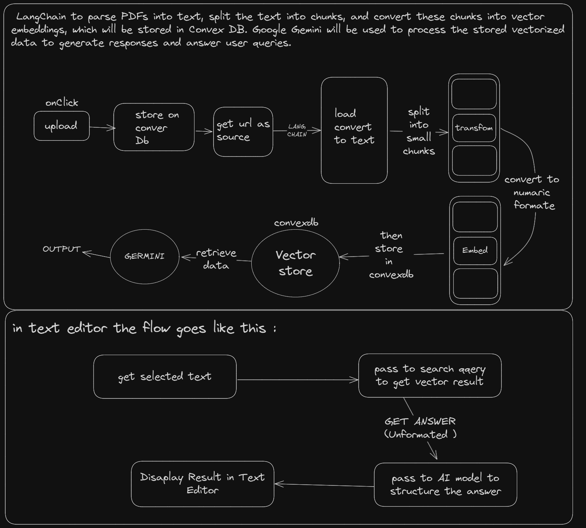

# AI PDF Chatbot Fullstack

AI PDF Chatbot Fullstack is a SaaS platform designed to help users interact with and analyze PDF documents using advanced AI. It employs LangChain to parse PDFs into text, split them into manageable chunks, and create vector embeddings stored in Convex DB. Google Gemini is used to process these vectors, enabling the platform to generate intelligent, context-aware responses for user queries. With secure authentication provided by Clerk and integrated PayPal for payments, this tool offers an efficient, AI-driven way to understand and chat with PDF content.

## Technologies Used

- **Next.js**: A React-based framework for building server-side rendered (SSR) applications.
- **Clerk**: Authentication and user management service.
- **Google Generative AI**: Integration with Google’s AI API for advanced document processing.
- **LangChain**: A framework for building applications powered by LLMs (Large Language Models) such as GPT.
- **Radix UI**: Component library for building user interfaces with accessible, customizable components.
- **Paypal React**: Payment integration for handling transactions.
- **Tailwind CSS**: Utility-first CSS framework for custom styling.
- **Convex**: Real-time data fetching and mutation in a serverless backend environment.
- **PDF-Parse**: PDF text extraction utility.
- **Tiptap**: A headless rich-text editor for React.
- **Axios**: Promise-based HTTP client for making requests.
- **Sonner**: A lightweight and customizable toast notification library.
- **UUID4**: To generate unique identifiers.

## Approch used



## Setup & Installation

### Prerequisites

- [next](https://www.npmjs.com/package/next)
- [tailwindcss](https://www.npmjs.com/package/tailwindcss)
- [axios](https://www.npmjs.com/package/axios)
- [pdf-parse](https://www.npmjs.com/package/pdf-parse)
- [langchain](https://www.langchain.com/)
- [Google AI Studio](https://aistudio.google.com/app/apikey)
- [convex](https://www.npmjs.com/package/convex)
- [shadcn](https://ui.shadcn.com/)
- [clerk](https://www.npmjs.com/package/@clerk/nextjs)
- [tiptap](https://tiptap.dev/)
- [paypal](https://www.npmjs.com/package/@paypal/react-paypal-js)
- [motion](https://www.npmjs.com/package/motion)

### Installation Steps

1. **Clone the repository**:

   ```bash
   git clone https://github.com/Tejas-pr/AI-PDF-Chatbot-Fullstack.git
   cd AI-PDF-Chatbot-Fullstack
   ```

2. **Install dependencies:**:

   ```bash
   git clone https://github.com/Tejas-pr/AI-PDF-Chatbot-Fullstack.git
   cd AI-PDF-Chatbot-Fullstack
   ```

3. **Setup Environment Variables:**:
   - Copy the .env.example file to .env:
   ```bash
   cp .env.example .env
   ```
   - Add your Clerk API keys, Google AI API credentials, Convex credentials, and PayPal integration in the .env file:
4. **Run the Development Server:**:
   ```bash
   npm run dev
   ```
   Visit http://localhost:3000 in your browser to see the application running.

### License

This README includes sections for:

- Project Overview
- Technologies used in the project
- Installation and Setup Instructions
- Local Development and Running the Application
- Links to relevant documentation

Feel free to expand the documentation if necessary!

##

leave a star to repo  
Thank you 👋  
tejas.teju02@gmail.com
